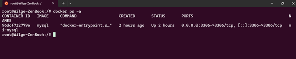
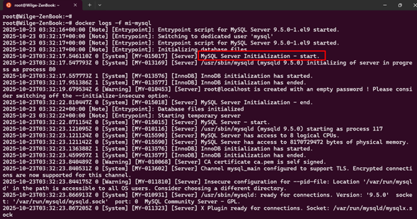
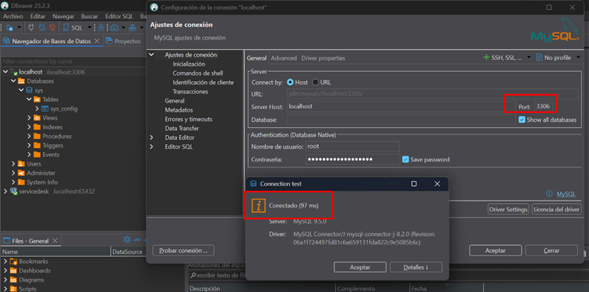
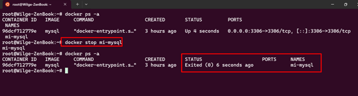
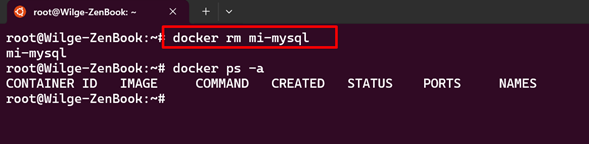

1. **Nombre de la aplicación** - MySQL (base de datos relacional)

2. **Comandos ejecutados** - Para la ejecucion del contenedor MySql se ejecutaron los siguientes comando:
   - Comando para crear y levantar el contenedor MySql en el puerto 3306 y con password
     ```{bash, engine.opts='-l'}
        docker run --name mi-mysql -e MYSQL_ROOT_PASSWORD=mi-password-seguro -p 3306:3306 -d mysql
     ```
   - Comandos de verificación
     ```{bash, engine.opts='-l'}
        docker ps -a
     ```
   - Comandos de limpieza
     ```{bash, engine.opts='-l'}
        docker stop mi-mysql
        docker rm mi-mysql
     ```
3. **Explicación breve** - Acontinuacion se detalla brevemente los comandos utilizados para la resolucion de la tarea solicitada

4. **Evidencia:**
   - Screenshot de `docker ps` mostrando el container corriendo
     
   - Screenshot salida de `docker logs` de mysql
     
   - Screenshot conexion a mysql desde Dbeaver
     
   - Screenshot o salida mostrando que el container fue eliminado correctamente
     
     


